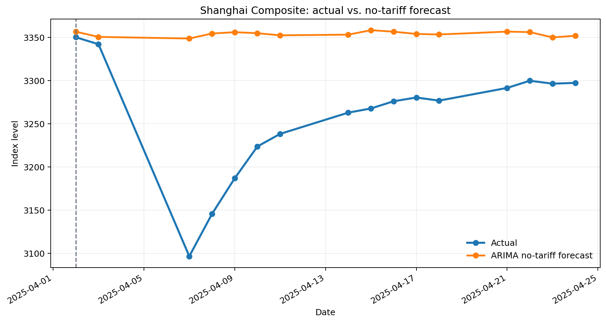
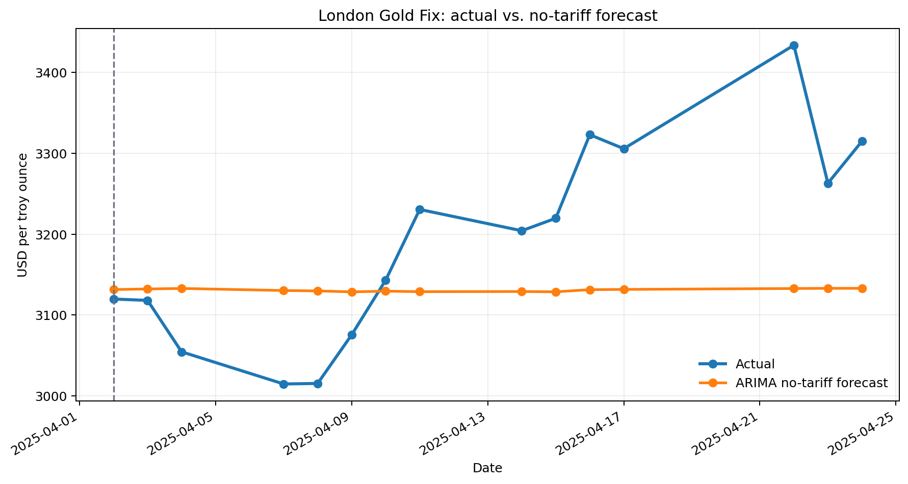

# The Impact of Tariff Events on Stock and Gold Markets

> An ARIMA-based empirical analysis of the Shanghai Composite Index and the London Gold Fix around the April 2025 tariff event.

This repository presents the original analysis behind the independently authored conference paper **“Research on the Impact of Tariff Incidents on the Stock and Gold Markets: An Empirical Analysis Based on the ARIMA Model.”** The paper was accepted by the **2025 5th International Conference on Economic Management and Corporate Governance (EMCG 2025)**.

The work was conducted as a supervised research project from **April 2025 to May 2025**. It is organized here as an academic portfolio and reproducibility record; no models were re-estimated and no conclusions were added when preparing this repository.

## Research design

The tariff event is treated as the intervention point. Data available before the event are used to estimate each model; post-event forecasts therefore represent a **no-tariff counterfactual**. The analysis then compares those forecasts with observed market prices.

| Market | Sample | Model | Diagnostic reported in the paper |
|---|---|---:|---:|
| Shanghai Composite Index (SSEC) | Jan 2015–Apr 2025 | ARIMA(14, 1, 14) | Ljung–Box p = 0.9994 |
| London Gold Fix | Jan 2015–Apr 2025 | ARIMA(12, 1, 12) | Ljung–Box p = 0.8677 |

The workflow applies log transformation, first differencing, ADF stationarity testing, ACF/PACF order identification, maximum-likelihood estimation, and Ljung–Box residual testing.

## Main results

The paper reports the largest highlighted post-event deviations as:

| Market | Actual vs. no-tariff forecast | Interpretation in the paper |
|---|---:|---|
| SSEC | **−8.14%** on 7 Apr 2025 | Negative short-term stock-market effect |
| Gold | **+8.76%** on 22 Apr 2025 | Positive short-term effect consistent with safe-haven demand |





These comparisons are descriptive counterfactual results from the original paper. They should not be interpreted as investment advice or as identification of all causal channels.

## Repository structure

```text
.
├── assets/                  # README figures generated from archived results
├── data/                    # Input series used by the notebooks
├── code/
│   ├── 01_ssec_arima_diagnostics.ipynb
│   ├── 02_gold_arima_diagnostics.ipynb
│   ├── 03_ssec_counterfactual_forecast.ipynb
│   └── 04_gold_counterfactual_forecast.ipynb
├── paper/                   # Paper title, venue, status, and abstract
├── results/                 # Archived forecasts and paper result tables
└── requirements.txt
```

## Reproduce the original workflow

```bash
python -m venv .venv
source .venv/bin/activate       # Windows: .venv\Scripts\activate
pip install -r requirements.txt
cd notebooks
jupyter lab
```

Open the notebooks in numerical order. The diagnostic notebooks document stationarity, order identification, model fitting, and residual tests. The forecast notebooks reproduce the archived 30-step forecast workflow and save workbooks under `results/`.

Return to the repository root to rebuild only the public CSV tables and README figures from the archived paper result workbook:

```bash
python scripts/build_public_results.py
```

## Author

```text
Wang, Yiyang. “Research on the Impact of Tariff Incidents on the Stock and Gold Markets:
An Empirical Analysis Based on the ARIMA Model.” Proceedings of the 2025 5th
International Conference on Economic Management and Corporate Governance (EMCG 2025), 2025.
```

## Disclaimer

This repository is for academic and portfolio purposes only. It does not provide investment advice, trading recommendations, or a production forecasting system.
